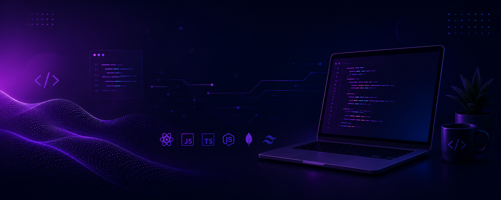

  

<h1 align="center">Hi 👋 I'm Saju</h1>

<b>Full Stack Developer</b> from Bangladesh 🇧🇩

  
  
  

---

## About

I am a Full Stack Developer who has built three production-grade platforms across job search, healthcare, and developer-tooling domains. I focus on backend correctness, security, and data integrity — idempotent payment flows, role-based access control, JWT/JWKS verification, and transactional consistency.

I am currently deepening my expertise in secure API design and payment system architecture, while continuing to build with React, Next.js, TypeScript, and Node.js/Express.

---

## Featured Projects

**[CareerPilot](https://careerpilot-client.vercel.app/)** — AI-Powered Job Board & Career Platform  
Built an AI Career Advisor and Cover Letter Generator using the Google Gemini API with Zod-validated, auto-retrying responses. Enforced RBAC across Next.js middleware, React route guards, and Express ownership checks; closed an open-redirect vulnerability in login.

`Next.js` `TypeScript` `Express` `MongoDB` `Gemini API` `Zod`

[Live Site](https://careerpilot-client.vercel.app/) · [Client Repo](https://github.com/md-saju-ahmed/careerpilot-client) · [Server Repo](https://github.com/md-saju-ahmed/careerpilot-server)

 

**[Medicare Connect](https://medicare-connect-client-iota.vercel.app)** — Full Stack Healthcare Platform  
Three-role appointment platform for patients, doctors, and admins with an idempotent Stripe payment flow that re-verifies checkout sessions before confirming bookings. Closed an IDOR vulnerability and prevented double-booking with pre-insert conflict checks.

`Next.js` `Node.js` `Express` `MongoDB` `Stripe`

[Live Site](https://medicare-connect-client-iota.vercel.app) · [Client Repo](https://github.com/md-saju-ahmed/medicare-connect-client) · [Server Repo](https://github.com/md-saju-ahmed/medicare-connect-server)

 

**[StackPulse](https://stackpulse-client.vercel.app/)** — Developer Tools Discovery Platform  
Searchable dev tools directory with a three-state admin moderation queue. Kept ratings and review counts consistent using MongoDB transactions; reduced redundant requests with TanStack Query caching and debounced search.

`Next.js` `TypeScript` `Express` `MongoDB` `TanStack Query` `Zod`

[Live Site](https://stackpulse-client.vercel.app/) · [Client Repo](https://github.com/md-saju-ahmed/stackpulse-client) · [Server Repo](https://github.com/md-saju-ahmed/stackpulse-server)

---

## Tech Stack

**Languages**

  
  

**Frontend**

  
  
  

**Backend & Database**

  
  
  

**Tools & Platforms**

  
  
  
  

---

## GitHub Insights

  
  

  

---

## Connect

  
  
  
  

