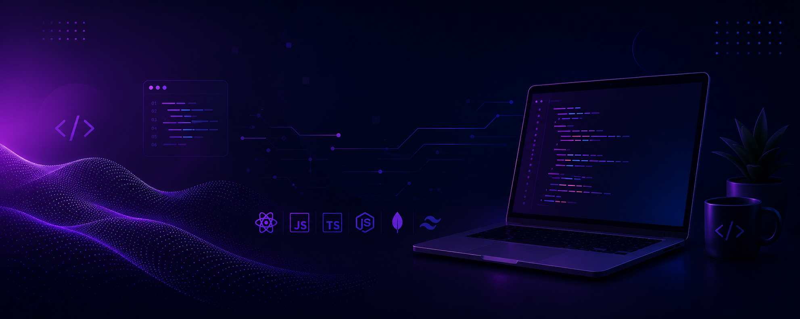

  

<h1 align="center">Hi 👋 I'm Saju</h1>

<b>Full Stack Developer</b> from Bangladesh 🇧🇩

  
  
  

---

## About

I am a Full Stack Developer from Bangladesh specializing in TypeScript and Next.js. I build secure, reliable, and scalable web applications with a strong focus on backend architecture, authentication, API design, and data integrity.

### Current Activities

- Building production-ready full stack applications with Next.js and TypeScript
- Exploring AI integrations using the Google Gemini API
- Learning secure API design, authentication, and payment system architecture
- Improving data structures, algorithms, and system design skills

---

## Tech Stack

**Languages**

  
  

**Frontend**

  
  
  
  
  

**Backend & Database**

  
  
  
  
  
  

**Integrations**

  
  

**Tools & Platforms**

  
  
  

---

## GitHub Insights

  

---

## Connect

  
  
  
  

